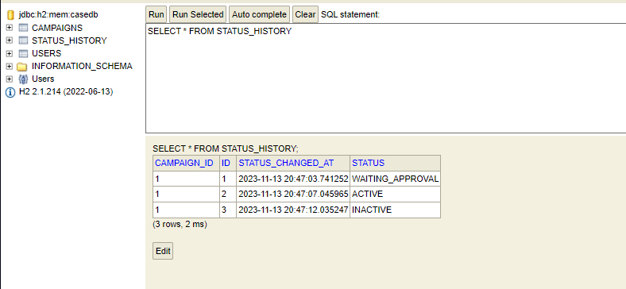
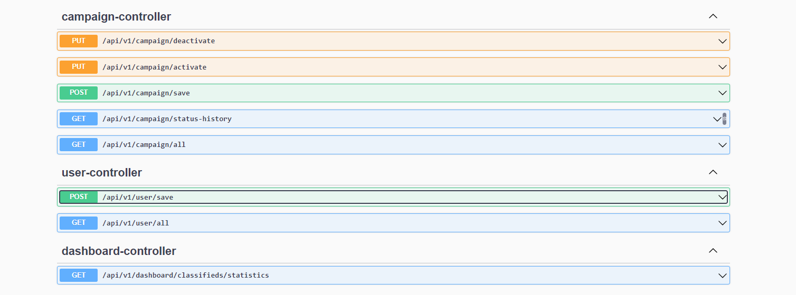
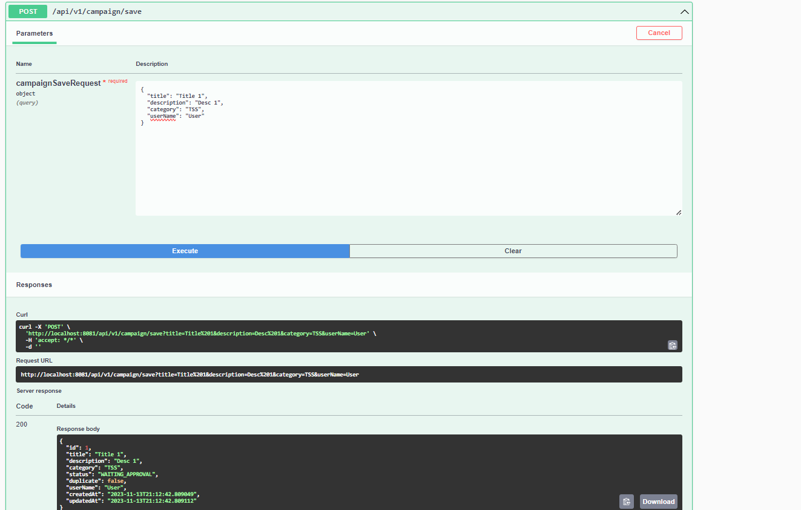
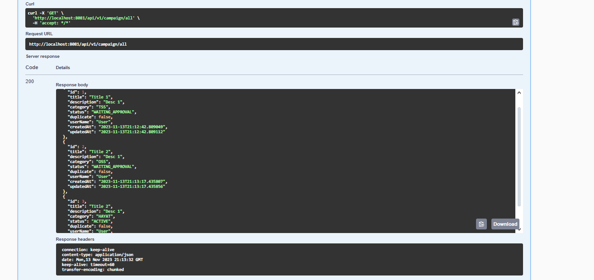
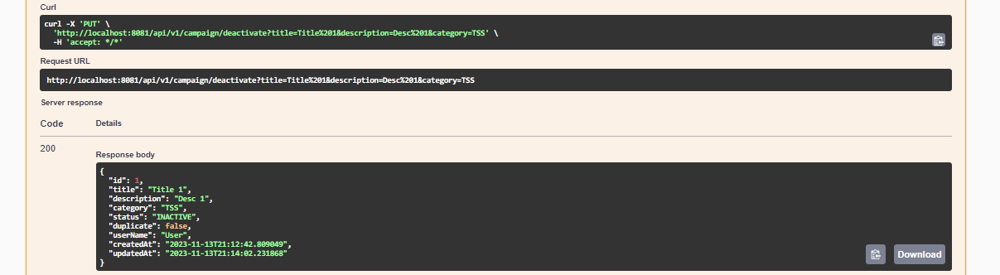
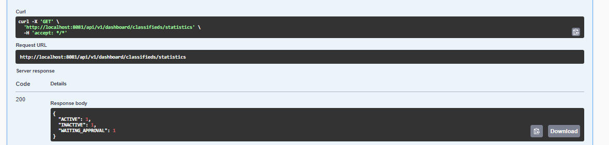
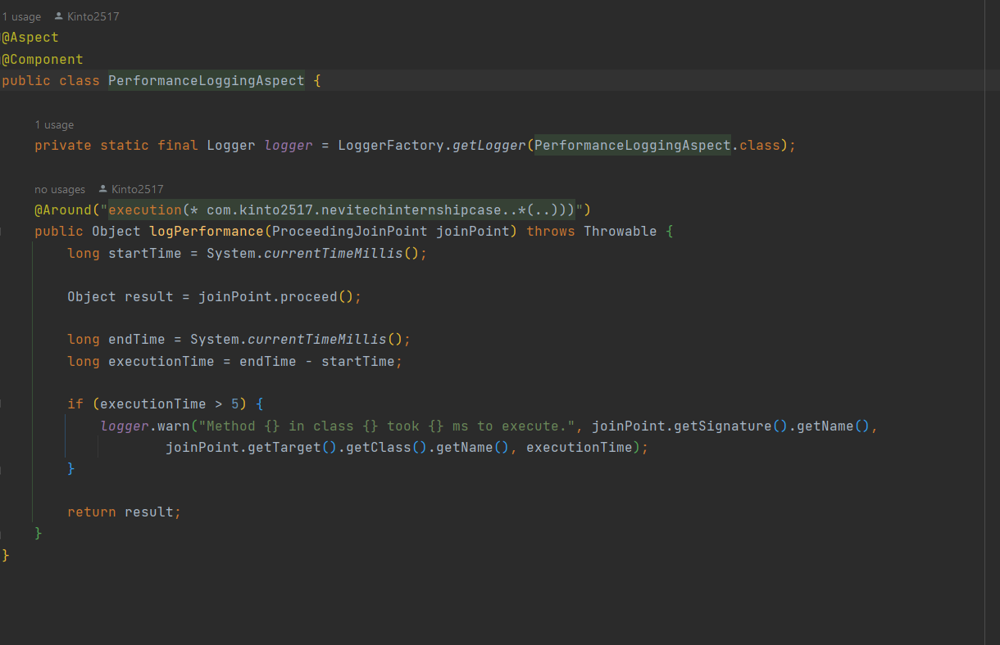

<a name="readme-top"></a>

<details>
  <summary>Table of Contents</summary>
  <ol>
    <li>
      <a href="#about-the-project">About The Project</a>
    </li>
    <li>
      <a href="#getting-started">Getting Started</a>
    </li>
    <li><a href="#built-with">Built With</a></li>
    <li><a href="#usage">Usage</a></li>
    <li><a href="#contributing">Contributing</a></li>
    <li><a href="#contact">Contact</a></li>
  </ol>
</details>


## About The Project

NeviTechInternshipCase is a web application that manages campaigns. It allows users to create, activate, deactivate campaigns, and view their status history.
The project follows modern software development practices, leveraging Spring Boot for backend development, Spring Data JPA for data persistence, and a RESTful API for communication.

This is the API that I developed for my internship at NeviTech.

<p align="right">(<a href="#readme-top">back to top</a>)</p>

## Getting Started

### Prerequisites

Before you begin, make sure you have the following prerequisites:

* Docker installed on your system.
* Docker Compose installed.
* Java IDE installed.

### Installation Steps

#### Clone the Repository:

Start by cloning the NeviTechInternshipCase repository to your local machine.

```
git clone https://github.com/Kinto2517/NeviTechInternshipCase.git
```

#### Set Up Docker Compose File:

```diff
@@ Uygulamanın containerize edilmesi @@
```

Open a terminal in the same folder as 'Dockerfile' in the root directory where you cloned the repository.
```
FROM openjdk:17-jdk-alpine

WORKDIR /app

COPY target/NeviTechInternshipCase-0.0.1-SNAPSHOT.jar /app/app.jar

EXPOSE 80801

CMD ["java", "-jar", "app.jar"]

```
Build the dockerfile with this command:
```
docker build -t nevitech-internship-case:latest .
```
Then start the project via 
```
docker run -p 8081:8081 nevitech-internship-case:latest
```


#### Starting The Project

Start the project with your favorite IDE with Docker running.

<p align="right">(<a href="#readme-top">back to top</a>)</p>

## Built With

* 
* 
* 
  
<p align="right">(<a href="#readme-top">back to top</a>)</p>


## Usage

### Database (H2 in-memory Database)



* As seen here project uses in-memory database for its simple database connection.
* It also shows the Status History so 'Bonus' requirement is met.

```diff
@@ Bir ilana ait zamanla oluşan tüm durum değişikliklerini listeleme (BONUS) @@
```



### User Controller
* As seen above this API provides simple calls to save the user and get all the users.


### Campaign Controller


  
* Whenever we save a new campaign, backend will look for the category in the SaveRequest and if its "TSS", "OTHER" or "OSS" it will assign "AWAITING_APPROVAL" otherwise it will assign "ACTIVE" if its not null.
* It will also be sure if the title, description and category are same it will mark it as duplicated.
```diff
@@ Aynı kategoride, aynı başlık ve açıklamaya sahip kampanya girildiğinde "Mükerrer" olarak işaretlenmelidir, mükerrer ilanların durumu güncellenemez. @@
```
  
* This will cover this requirement.

```diff
@@ Kampanya ilk verildiğinde TSS, ÖSS ve Diğer kategorisi için "Onay Bekliyor" durumunda,bunların dışındaki kategoriler için ise "Aktif" durumda olmalıdır. @@
@@ Özetle Hayat Sigortası kategorisi dışındakiler onaydan geçerek "Aktif" hale gelebilecektir. @@
```


#### User Deactivate and Activate Calls



```diff
@@ "Onay Bekliyor" durumundaki kampanya onaylandığında "Aktif" hale gelir. (İlanlar her daim onaylanacakmış ve reddedilmeyecekmiş gibi varsayılabilir) @@
@@ Kullanıcı "Aktif" durumdaki veya "Onay Bekliyor" durumdaki ilanını "Deaktif" yapabilir. @@
```

### Dashboard Controller



* In this section, this API call will show the "ACTIVE", "INACTIVE" and "WAITING_APPROVAL" counts in the database.

```diff
@@ Kayıtlı tüm kampanyaların toplamda hangi durumlarda olduğunun istatistiksel -Aktif: 151, -Deaktif: 71 gibi olarak listelenmesi. GET /dashboard/classifieds/statistics @@
```

### Unit Tests

* This project also provides unit tests for controllers and services for both Campaign and User entities.

### Performance Logging 



* As seen above this code provides a calcutation for all the methods in the project and it logs every methods calls that extends the 5 ms time limit.

```diff
@@ Çalışma süresi 5 milisaniyeden fazla süren isteklerin her defasında loglanması @@
```


<p align="right">(<a href="#readme-top">back to top</a>)</p>


## Contributing

Contributions are what make the open source community such an amazing place to learn, inspire, and create. Any contributions you make are **greatly appreciated**.

If you have a suggestion that would make this better, please fork the repo and create a pull request. You can also simply open an issue with the tag "enhancement".
Don't forget to give the project a star! Thanks again!

1. Fork the Project
2. Create your Feature Branch (`git checkout -b feature/AmazingFeature`)
3. Commit your Changes (`git commit -m 'Add some AmazingFeature'`)
4. Push to the Branch (`git push origin feature/AmazingFeature`)
5. Open a Pull Request

<p align="right">(<a href="#readme-top">back to top</a>)</p>


## Contact

* Ersin Yılmaz ASLAN - [My LinkedIn](https://tr.linkedin.com/in/ersinya)
* Project Link: [NeviTech Internship Case](https://github.com/Kinto2517/NeviTechInternshipCase)

<p align="right">(<a href="#readme-top">back to top</a>)</p>
